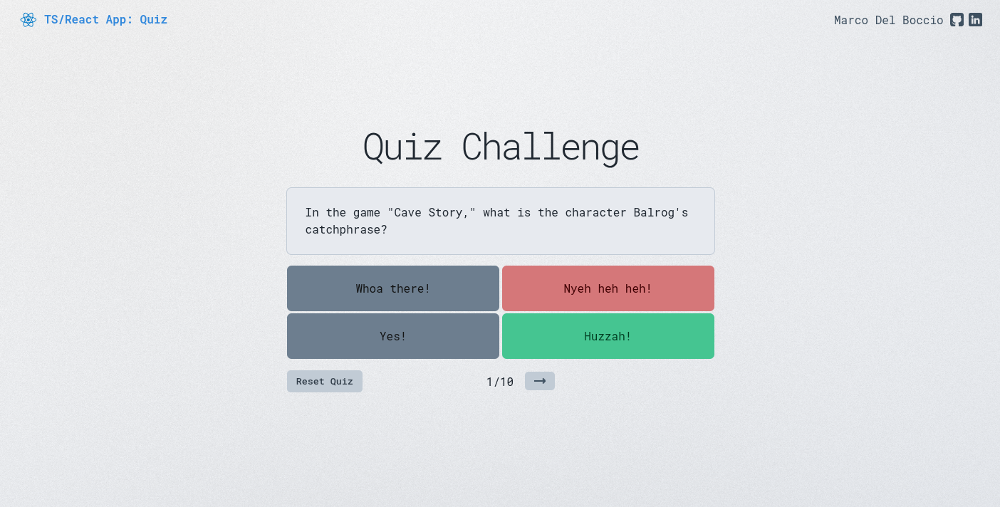

<div align="center">
  <a href="https://ts-react-app-quiz.netlify.app">
     
  </a>
  <h3>
    <strong>TS/React App: Quiz</strong>
  </h3>
  <p>Una aplicación interactiva de quiz desarrollada con React y TypeScript que pone a prueba conocimientos de cultura general a través de preguntas prácticas.</p>

  <div align="center">

  [](https://vitejs.dev/) 
  [](https://www.typescriptlang.org/)
   
  [](https://zustand-demo.pmnd.rs/)
  [](https://sass-lang.com/) 
  [](https://eslint.org/) 

  </div>

</div>

## 🚀 Características

- **Interfaz Moderna y Responsiva**: Diseño limpio y adaptable.
- **Gestión de Estado**: Implementado con Zustand para un manejo óptimo del estado.
- **Persistencia**: Sus avances se guardan automáticamente en el navegador.
- **Navegación Intuitiva**: Avance y retroceda entre preguntas con facilidad.
- **Estadísticas**: Visualiza un resumen sencillo al completar el quiz
- **TypeScript**: Desarrollo con tipado estático para mayor robustez
- **Carga Dinámica de Preguntas**: Obtención de preguntas desde una API externa con manejo de errores y estados de carga.
- **Validación de Respuestas**: Asegura la precisión en la interacción.

## 🎮 Guía de Uso

1. **Iniciar Quiz**: Simplemente haga clic en el botón de inicio.
2. **Responder Preguntas**: Selecciona la respuesta correcta para cada pregunta
3. **Navegar**:  Use los botones de "Siguiente" o "Anterior" para moverse entre preguntas o revisar sus selecciones.
4. **Ver Resultados**: Al completar todas las preguntas, visualiza tus estadísticas
5. **Reiniciar**: Comienza un nuevo quiz cuando desees


## 📦 Instalación

```bash
# Clonar el repositorio
git clone git@github.com:codentide/ts-react-app-quiz.git

# Navegar al directorio
cd ts-react-app-quiz

# Instalar dependencias
pnpm install

# Iniciar servidor de desarrollo
pnpm dev
```

## 📁 Estructura del Proyecto

```
src/
├── components/         # Componentes React reutilizables
├── hooks/              # Custom hooks
├── store/              # Gestión de estado con Zustand
├── services/           # Servicios para obtener datos
├── adapters/           # Adaptadores de datos
├── scss/               # Estilos SCSS organizados
└── types.d.ts          # Definiciones de tipos TypeScript
```
## 🔧 Scripts Disponibles

```bash
pnpm dev      # Servidor de desarrollo
pnpm build    # Construcción para producción
pnpm preview  # Vista previa de la construcción
pnpm lint     # Análisis de código con ESLint
```

## 🎨 Personalización

El proyecto utiliza SCSS con una arquitectura modular:

- `base/` - Variables y configuración base
- `components/` - Estilos específicos de componentes
- `main.scss` - Punto de entrada principal

## 📄 Licencia

Este proyecto está bajo la Licencia MIT.

